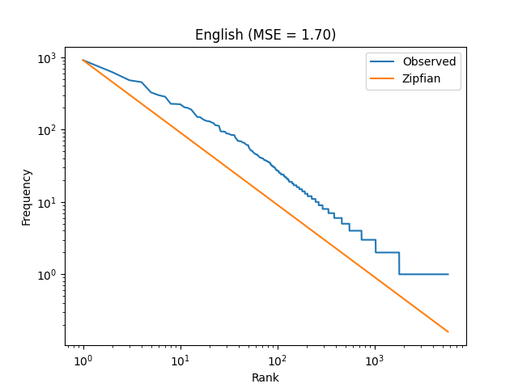
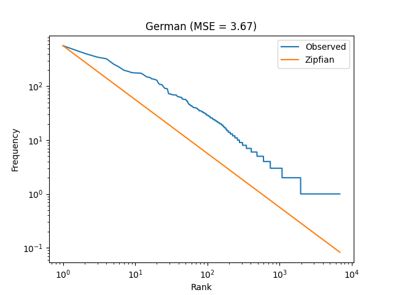
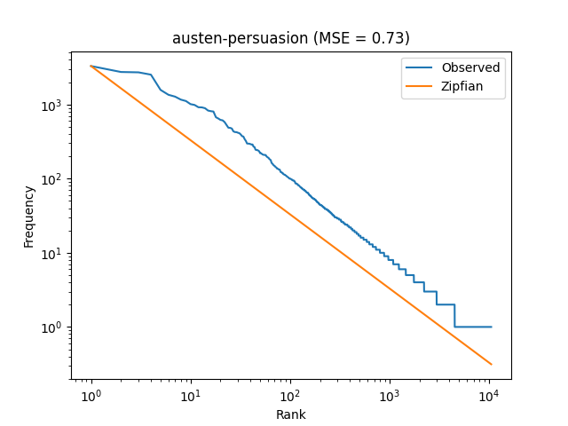
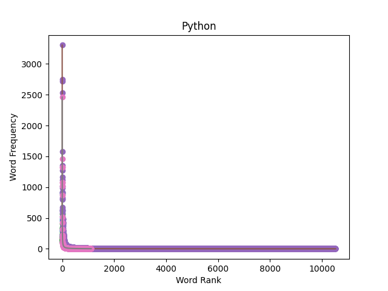

Name 1: Prashant Bhardwaj <br />
Student id 1: 7029400 <br />
Email 1: prbh00001@stud.uni-saarland.de <br />


Name 2: Manisha Singh <br />
Student id 2: 7029101 <br />
Email 2: masi00009@stud.uni-saarland.de<br/> 

1. [This is code for the Analysis Function](./exercise_2.py)

2. [This is the modified code for showing the plot of the English, German, "austen-persuasion" and Python (I could not find the `PIRATES OF THE CARRIBEAN: DEAD MAN'S CHEST` in the nltk corpus So I used "austen-persuasion")](./Assignment1.py)

3. For running the project just clone this link using 
```bash
git clone https://github.com/Prashant-Bhar8waj/Assignment-1.git
```
4. Open the terminal and run the following commands to install the dependencies 
```bash
pip install -r requirements.txt

```
5. In terminal Run this file to see the plots 
```bash
python Assignment.py
```

Exercise 2.1
These are the plots after using the analysis function






MSE for the Curves resplectively are :
```bash
Mean Squared Error: 1.703206791790246
Mean Squared Error: 3.6735349682341853
Mean Squared Error: 0.7288796650245711
Mean Squared Error: 0.3319513937090788
```

For Exercise 1:

- To compute p(b|c), we need to apply Bayes' theorem, which requires the calculation of p(c), p(b), and p(c|b). However, we only have information about p(a,a), p(c,c), p(b,a), p(b,b), and p(a,c), and the unigram probabilities of a and b. Thus, we don't have enough information to directly calculate p(b|c).

- We could try to use the Markov assumption that the current event only depends on the preceding event, and assume that p(c|b) is equal to p(c), but this assumption may not hold true. Therefore, we cannot confidently compute p(b|c) with the given information.


Exercise 2.2

- If the plot shows a linear relationship between log(rank) and log(frequency), and the MSE is relatively low, then Zipf's law can be considered an accurate prediction of the data which is the case of "English", "austen-persuasion" and "Python" as we can see from the plots.


- However, if the plot deviates significantly from a linear relationship and/or the MSE is high, then Zipf's law may not be an accurate prediction of the data which is the case for "German" as we can see from the plots.

Exercise 2.3
 - Vocabulary: Each language has its own unique vocabulary, which means that certain words or concepts may not have a direct translation into another language. This can affect the accuracy of machine translation and other NLP tasks that rely on understanding the meaning of words.
 - Grammar: The grammatical rules and structure of each language can vary greatly, which can affect the way sentences are constructed and the meaning of words within them. This can make it challenging to develop algorithms that accurately analyze or generate text in multiple languages.
 - Word order: The order in which words are arranged within sentences can vary between languages. For example, in English, the standard word order is subject-verb-object (SVO), while in Japanese it is subject-object-verb (SOV). This can affect the way in which machine translation systems and other NLP algorithms are designed.

  Refrence [Wikipedia page on Word Order](https://en.wikipedia.org/wiki/Word_order).


Exercise 2.4

- The vertical gaps or "steps" in the plot for high-rank words (rightmost) are caused by the limited size of the dataset. As the rank increases, the frequency of the words decreases, and the number of words with that frequency also decreases. This leads to a smaller sample size for those words, which results in a higher level of noise and variance in the frequency estimates. This makes it harder to accurately estimate the true frequency of high-rank words, leading to the gaps in the plot.


[For Bonus](./Bonus.py) 
```python
from exercise_2 import analysis
import matplotlib.pyplot as plt

# Experiment 1: Don't lowercase anything
with open("data/macbeth_en.txt", "r") as f:
    p, m = analysis("English", f.read().split())
    plt.savefig('my_plot5.png')

# Experiment 2: Use character level tokenization, rather than word level
with open("data/macbeth_en.txt", "r") as f:
    data = f.read()
    tokens = [c for c in data if c != ' ' and c != '\n']
    p, m = analysis("English", tokens)
    plt.savefig('my_plot6.png')
````
