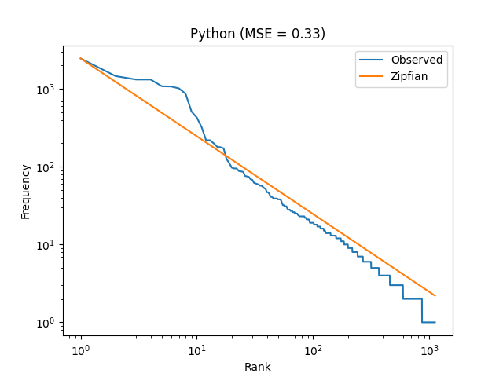

1. [This is code for the Analysis Function which is](./exercise_2.py)

2. [This is the modified code for showing the plot of the English, German, "austen-persuasion" (I could not find the `PIRATES OF THE CARRIBEAN: DEAD MAN'S CHEST` in the nltk corpus)](./Assignment1.py)

3. For running the project just clone this link using 
```bash
git clone https://github.com/Prashant-Bhar8waj/Assignment-1.git
```
4. Open the terminal and run the following commands to install the dependincies 
```bash
pip install -r requirements.txt

```
5. In terminal Run this file to see the plots 
```bash
python Assignment.py
```

These are the plots after using the analysis function





MSE for the Curves resplectively are :
```bash
Mean Squared Error: 85.21973406158385
Mean Squared Error: 72.47734079360484
Mean Squared Error: 1622.9310249539299
Mean Squared Error: 2193.180837099103
```

For Exercise 1:
```
To compute p(b|c), we need to apply Bayes' theorem, which requires the calculation of p(c), p(b), and p(c|b). However, we only have information about p(a,a), p(c,c), p(b,a), p(b,b), and p(a,c), and the unigram probabilities of a and b. Thus, we don't have enough information to directly calculate p(b|c).

We could try to use the Markov assumption that the current event only depends on the preceding event, and assume that p(c|b) is equal to p(c), but this assumption may not hold true. Therefore, we cannot confidently compute p(b|c) with the given information.
```


